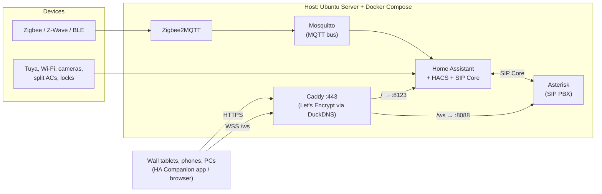

# Majlis — whole-home automation

A **local-first smart-home stack** for a new three-floor house in Muscat, Oman, kept in Git like any other codebase. It pulls Tuya / Smart Life, other Wi-Fi gear, Zigbee, cameras, locks and split-AC units out of separate vendor apps and into one system on **[Home Assistant](https://www.home-assistant.io/)**, with wall tablets around the house and a **SIP intercom** between them.


- **The UI is Home Assistant itself.** Dashboards are YAML in this repo, built from HACS cards, and shown on the tablets, phones and PCs. There is no custom app.
- **The intercom is SIP.** Asterisk is the PBX; the [SIP Core](https://github.com/TECH7Fox/sip-hass-integration) integration puts a softphone inside HA, with ringing, incoming-call popups and contacts.
- **Scalable by design.** Dashboards render by *area*, so a new device assigned to a room shows up with no dashboard edit.
- **Runs on a repurposed laptop.** Headless Ubuntu Server on an i3 / 6 GB IdeaPad, whose battery doubles as a UPS.

---

## Contents

1. [Architecture](#architecture)
2. [The stack](#the-stack)
3. [Hardware](#hardware)
4. [Repository layout](#repository-layout)
5. [Setup, step by step](#setup-step-by-step)
6. [The tablet dashboard](#the-tablet-dashboard)
7. [The intercom](#the-intercom)
8. [Remote access](#remote-access)
9. [Day-to-day operations](#day-to-day-operations)
10. [Conventions and guardrails](#conventions-and-guardrails)
11. [Status, known risks and roadmap](#status-known-risks-and-roadmap)
12. [Design language](#design-language)
13. [Credits](#credits)

---

## Architecture

One rule holds the whole thing together:

> **Devices talk to Home Assistant, and everything a person touches talks to Home Assistant.**

HA normalises every device into an *entity*. Dashboards, automations and the intercom UI sit on entities and areas, never on a vendor's device API. Swapping a cloud Tuya bulb for a local Zigbee one later must not touch a dashboard. Anything that reaches around HA to a device API is a design smell.

Asterisk and Caddy are infrastructure *beside* HA, like Mosquitto. **SIP Core is the HA integration that fronts Asterisk**, so dashboards use SIP Core's cards and never talk to Asterisk directly.



Calls are WebRTC (DTLS-SRTP) between the browsers. **There is no STUN or TURN**: the house is one LAN, so host candidates are enough and nothing depends on a third party. The internet is needed only to renew the TLS certificate.

## The stack

Everything is defined in a single [`docker-compose.yml`](docker-compose.yml). This is deliberately **not** Home Assistant OS, so there are no HA add-ons and no Supervisor: extras are Compose containers beside HA.

| Service | Image | Role |
|---|---|---|
| `homeassistant` | `ghcr.io/home-assistant/home-assistant:stable` | The brain and the UI. Host network (discovery/mDNS) and `privileged` (USB/Bluetooth). |
| `mosquitto` | `eclipse-mosquitto:2` | MQTT bus. Authenticated listener on `1883`, no anonymous access. |
| `zigbee2mqtt` | `koenkk/zigbee2mqtt` | Zigbee coordinator bridge (preferred over ZHA for device coverage) on a Sonoff ZBDongle-P. Frontend on `8080`, no login, LAN only. |
| `asterisk` | `ghcr.io/tech7fox/asterisk-hass-addon:6.2.0` | SIP PBX for the intercom. **Pinned**: the project has had breaking releases, so bumps are deliberate. Host network. |
| `caddy` | custom build (`caddy/Dockerfile`) | HTTPS front door with the DuckDNS DNS module. Serves `https://$SITE_HOST` on `443`, proxying `/` to HA and `/ws` to Asterisk. |
| `twingate` | `twingate/connector:1` | Remote access. Outbound-only connector: no router port, no public DNS name. See [Remote access](#remote-access). |
| `wireguard` + `duckdns-wg` | `lscr.io/linuxserver/wireguard` | Fallback VPN behind the Compose profile `wireguard`, so a plain `up -d` never starts it. Never started so far. |
| `frigate` | *(later)* | Camera AI. Deferred: it is the memory hog on a 6 GB host. |

**HACS** is installed inside HA. Integrations in use include `sip_core`, `tuya_local`, `localtuya`, `xtend_tuya`, `hikconnect`, `hikvision_next`, `google_home` and TCL. Cards include Bubble Card, button-card, decluttering-card, card-mod, auto-entities, mushroom, navbar-card, mini-graph-card, swipe-card, weather-card, kiosk-mode and **WallPanel**.

### Ports

| Port | Proto | Service | Notes |
|---|---|---|---|
| 443 | TCP | Caddy | What every client uses. |
| 8123 | TCP | Home Assistant | Behind Caddy; proxied over `127.0.0.1`. |
| 1883 | TCP | Mosquitto | Password-protected. |
| 8080 | TCP | Zigbee2MQTT | Frontend. |
| 8088 | TCP | Asterisk | Plain `ws`, reached only through Caddy at `/ws`. |
| 5060 | UDP/TCP | Asterisk | SIP. Unused by browsers; restrict it if you have no desk phones. |
| 5038 | TCP | Asterisk AMI | Password-protected. Currently listens on all interfaces; restricting it to localhost is a hardening item. |
| 10000–20000 | UDP | Asterisk | RTP media range. |

## Hardware

- **Host:** repurposed Lenovo IdeaPad 3 (i3 10th-gen, 6 GB RAM, 256 GB SSD), headless Ubuntu Server LTS, lid-close set to ignore so it runs closed. The battery is a built-in UPS. The LAN IP is a DHCP reservation.
- **Wall panels:** identical large **Android** tablets, each running the **HA Companion app** logged in as its own HA user (`tab1`–`tab5`; the last two were added on 2026-10-07). Real Android with the Play Store, not Amazon Fire (locked FireOS, ads, weak camera). **LCD, not OLED**, so a static dashboard does not burn in. Charge-limit to roughly 40–80 % with a smart plug plus an HA automation.
- **Zigbee coordinator:** Sonoff ZBDongle-P (`adapter: zstack`, channel 20), running since 2026-10-02. The house is concrete, so Zigbee does not cross a floor slab: USB repeaters (HOBEIAN ZG-807Z) chain the signal up the stairwell. Battery IR remotes (ZG-IR01) on the same network switch the ACs that have no Wi-Fi.
- **RAM ceiling:** 6 GB comfortably runs HA + Mosquitto + Zigbee2MQTT + Asterisk + Caddy. Frigate waits for a mini PC (N100/i5, 16 GB) as the main brain or a dedicated camera box. Keep new services lean.

## Repository layout

```
.
├── docker-compose.yml           # single source of truth for the whole stack
├── .env                         # non-secret env (TZ, PUID, SITE_HOST, ZIGBEE_DONGLE_PATH, WG_*); committed
├── .env.secrets.example         # template for .env.secrets (DuckDNS + Twingate tokens); the real file is gitignored
├── homeassistant/               # HA config volume: only the human-editable YAML is committed
│   ├── configuration.yaml       #   themes, YAML dashboard registration, media folder, input_text helper
│   ├── automations.yaml · scenes.yaml · scripts.yaml
│   ├── dashboards/
│   │   ├── build_tablet.py      #   GENERATOR: edit this, not tablet.yaml
│   │   ├── tablet.yaml          #   generated wall-tablet dashboard (22 views)
│   │   └── majlis-call-wake.js  #   wakes the screensaver when a call comes in
│   ├── themes/majlis.yaml       #   "Majlis Glass" liquid-glass theme, Graphite palette
│   └── media/                   #   HA media library: screensaver photos, audio (gitignored)
├── mosquitto/config/mosquitto.conf
├── zigbee2mqtt/data/            # Z2M config lives here (runtime state is gitignored)
├── asterisk/                    # SIP PBX for the intercom
│   ├── roster.csv               #   extension <-> HA user map
│   ├── generate-secrets.sh      #   writes SIP/AMI passwords and the SIP Core options
│   └── config/asterisk/custom/rtp.conf   # the only tracked file under config/
├── caddy/                       # Dockerfile (xcaddy + DuckDNS module) and Caddyfile
├── design/                      # DESIGN.md (tokens, components) + majlis-os-reference.html (mockup)
├── docs/PROJECT-JOURNEY.md      # chronological walkthrough: what was done and why
├── systemd/majlis-compose.service
└── CLAUDE.md                    # project memory / decisions for AI-assisted sessions
```

Runtime state and anything secret is gitignored: HA's `.storage/`, databases and `secrets.yaml`; the Mosquitto password file; everything Asterisk or its generator writes; Caddy's issued certificates; the WireGuard keys; the media library; theme folders installed by HACS.

## Setup, step by step

These steps assume a fresh Ubuntu Server (LTS) with a static or DHCP-reserved LAN IP. Adapt names to your own house.

> **Docker note:** the dev user is not in the `docker` group here, so every command below uses `sudo docker`. Add yourself to the group if you prefer.

### 1. Prepare the host

```bash
# Docker Engine + the Compose plugin: follow https://docs.docker.com/engine/install/ubuntu/
git clone https://github.com/moodyminji/my-homeassistant-setup.git ~/majlis
cd ~/majlis
```

If this is a laptop, set `HandleLidSwitch=ignore` in `/etc/systemd/logind.conf` so it keeps running with the lid closed.

### 2. Get a name and a real certificate

Browsers and the HA Companion app expose the **microphone only on secure origins**, and the app's maintainers have closed "mic over http" as *not planned*. Over plain http, calls ring but **Answer does nothing**. So the stack serves HTTPS with a real certificate that needs no per-device setup.

1. Create a free subdomain at [duckdns.org](https://www.duckdns.org/) and point it at the host's **LAN IP** (a private address is fine).
2. Caddy obtains the certificate with the **DNS-01** challenge, so no inbound port is opened and only renewal needs the internet.
3. Fill in the config:

```bash
# .env: set your own name (the value below is a placeholder)
SITE_HOST=your-name.duckdns.org
TZ=Asia/Muscat
PUID=1000
PGID=1000

cp .env.secrets.example .env.secrets      # then put your DuckDNS token in it
```

### 3. Set up MQTT credentials

Mosquitto refuses anonymous clients, so create a user before anything connects:

```bash
sudo docker compose run --rm --no-deps mosquitto \
  mosquitto_passwd -c /mosquitto/config/passwd homeassistant
```

The password file is gitignored. Put the same credentials into HA's MQTT integration and into `zigbee2mqtt/data/configuration.yaml`.

### 4. Start the stack

```bash
sudo docker compose build caddy
sudo docker compose up -d homeassistant mosquitto asterisk caddy
```

Name the services explicitly on a new host. A bare `up -d` also starts `zigbee2mqtt`, which fails until `ZIGBEE_DONGLE_PATH` in `.env` points at your own coordinator. Use its **`/dev/serial/by-id/…`** path (never `ttyUSB0`, which renumbers on reboot; find it with `ls -l /dev/serial/by-id/`), then add `zigbee2mqtt` to the command.

### 5. Onboard Home Assistant

1. Open `https://your-name.duckdns.org` and complete HA's onboarding. Set the timezone to `Asia/Muscat` (or yours).
2. **Trust the reverse proxy in the UI.** HA 2026.9 migrates `http:` from `configuration.yaml` once and then ignores it. Do **not** put `http:` in YAML. Go to **Settings → System → Network**, enable the reverse-proxy option and trust `127.0.0.1` and `::1`. Without this every proxied request gets a `400`.
3. Install [HACS](https://hacs.xyz/) and add the integrations and cards listed under [The stack](#the-stack). Add `sip_core` and the dashboard cards at minimum.
4. Create your **areas** (this house has 14) and group them into **floors**. Assign every device to an area. Dashboards depend on it.
5. Create one HA user per wall tablet (`tab1`, `tab2`, …), plus any others you need.

### 6. Configure the intercom

See [The intercom](#the-intercom).

### 7. Set up the tablets

On each tablet: install the **HA Companion app**, log in at `https://your-name.duckdns.org` as that tablet's own user, grant the **microphone** permission, keep the screen on, and select the theme under **Profile → Theme → Majlis Glass**. Then open `/tablet-glass/home`.

### 8. Start on boot (optional)

`systemd/majlis-compose.service` brings the stack up at boot. Before enabling it:

- Edit `WorkingDirectory=` and `User=`/`Group=` to match your host. The unit ships with the author's paths.
- Its `ExecStart` currently lists only `homeassistant mosquitto`. **Add `asterisk caddy`** (and `zigbee2mqtt` once the dongle is set), or the intercom will not come back after a reboot.

```bash
sudo cp systemd/majlis-compose.service /etc/systemd/system/
sudo systemctl daemon-reload && sudo systemctl enable --now majlis-compose
```

## The tablet dashboard

The wall-tablet UI is a **YAML-mode dashboard in this repo**, registered in `configuration.yaml` as `/tablet-glass`. Its look is the **Majlis Glass** theme: liquid glass (blur, gradient fill, a faint top highlight) in a neutral **Graphite** palette with a single amber accent.

**`tablet.yaml` is generated.** Edit the constants in `homeassistant/dashboards/build_tablet.py` (rooms, colours, tablet names), then:

```bash
python3 -m pip install pyyaml          # once
python3 homeassistant/dashboards/build_tablet.py
```

Refresh the tablet. **No HA restart** is needed for dashboard changes; only registering the dashboard or changing `configuration.yaml`/helpers needs one.

**Layout.** Every page is a header (greeting | glass tab pill *Home / Intercom / Rooms* | "This tablet: `<room>`") over `[left rail | content | clock + weather + lock]`. HA's own header and sidebar are hidden by kiosk-mode, so the tab pill is the only navigation.

| Page | What it shows |
|---|---|
| **Home** | Three big status cards, nine room tiles with a live one-line status, ACs running. |
| **Intercom** | SIP Core's contacts and call cards. |
| **Rooms** | A search box (`input_text.tablet_search`, shared by all tablets) plus all 14 room tiles. |
| Hidden pages | Five category pages (Lighting, Climate, Media, Garden, Doors & locks) and one page per room (`room-<area_id>`), opened from the rail and the tiles. |

Live values (lights on, AC running, per-room status) are computed **in the browser** from `hass.entities`, `hass.devices` and `hass.states`, not hard-coded.

**Screensaver.** **WallPanel** starts after 120 s idle (`WALLPANEL_IDLE_S`). It shows only a clock and weather, with no photos and nothing fetched from the internet, and returns to `/tablet-glass/home` on wake.

To show photos instead, put them in HA's media library and point WallPanel at the folder with `show_images: true` and `image_url: media-source://media_source/local/screensaver`. The library is `homeassistant/media/` (set by `media_dirs` in `configuration.yaml`, because the container has no `/media` mount); upload through **Media → My media** or copy files into the folder. WallPanel reads one source only, so local and internet photos cannot be mixed: download the ones you want into the same folder.

**Screensaver vs calls.** WallPanel sits above SIP Core's incoming-call popup and swallows the first taps, so Answer and Decline did nothing on an idle tablet. `dashboards/majlis-call-wake.js` (loaded through `frontend: extra_module_url`) nudges WallPanel awake when a call starts. HA serves the copy in `www/`, so after editing it run `sudo install -m 644 homeassistant/dashboards/majlis-call-wake.js homeassistant/www/` and bump the `?v=` number in `configuration.yaml`.

### How it scales

- Lights are Tuya wall switches (`tuya_local`) shown per area; ACs are every `climate.*`; sprinklers come from `rainbird`.
- A new device in an **existing area** appears by itself.
- A brand-new **area** needs one line in `ROOMS` in the generator, plus one heading-and-card pair in the Lighting view. The Rooms search finds everything regardless.
- This house's entities do **not** follow `domain.area_device` naming and there is only one `light.*`, so filters match on **integration + area**, not `domain=light`.

To adopt this for your own house, start with `ROOMS` in `build_tablet.py`: its area IDs are this house's.

## The intercom

**How it works.** Asterisk is the PBX. SIP Core registers each browser or app to Asterisk over **WSS**, so the softphone lives inside HA. Cards: `custom:sip-contacts-card`, `sip-call-card`, `sip-call-button`, plus an incoming-call popup that opens by itself. Caddy terminates TLS and proxies `wss://$SITE_HOST/ws` to Asterisk's plain `ws` on `8088`.

**Extensions** (`asterisk/roster.csv`):

| Ext | Who | HA user |
|---|---|---|
| 201–205 | tab1–tab5 wall tablets | one HA user each, mapped by HA **user id** |
| 900 | Guest | SIP Core's `backup_user`, used by any other HA user (e.g. a PC) |

A device is reachable **only while its HA page or app is open and awake**.

### Setting it up

```bash
# 1. put your HA user ids in asterisk/roster.csv
#    (format: extension,display name,HA user id; leave the id blank for the guest line)
#    A user's id is in their dialog under Settings → People → Users, with Advanced mode on.

# 2. generate passwords and config (needs SITE_HOST in .env)
./asterisk/generate-secrets.sh

# 3. restart Asterisk so it reads the new files
sudo docker restart asterisk
```

The generator writes three files, **all gitignored**:

| File | Purpose |
|---|---|
| `asterisk/config/asterisk/custom/pjsip_custom.conf` | Asterisk endpoints, one password per extension. |
| `asterisk/config/config.json` | The AMI password. |
| `asterisk/sip-core-options.yaml` | Paste into HA: **Settings → Devices & services → SIP Core → Configure**. |

Then paste the contents of `sip-core-options.yaml` into that form. **Never edit `.storage/` by hand.**

- **Adding a device:** add a `roster.csv` line, run `FORCE=1 ./asterisk/generate-secrets.sh` (this **rotates every password**), restart Asterisk and paste the options again. Calls are down between the restart and the paste, and every tablet must **reload its page** afterwards to pick up its new password.
- **Changing only the address:** edit `custom_wss_url` in the SIP Core form. No rotation is needed.
- **Passwords:** never hand-write them into config. They come from the generator.

Each tablet endpoint is pinged every **30 s** (`qualify_frequency=30`) so the WebSocket does not idle out and Asterisk can tell when a registration has died.

### Checking health

```bash
sudo docker exec asterisk asterisk -rx "pjsip show contacts"     # who is registered right now
sudo docker logs --since 10m asterisk 2>&1 | grep -i -E "auth|regist|fail"
```

An extension with no contact line is not reachable: its tablet does not have the dashboard open and awake, or it is still using an old password.

### Later

- **Doors and cameras:** go2rtc (bundled with HA) for two-way camera audio. A SIP video door station (Dahua/Hikvision) can register straight to Asterisk as an endpoint and appear in the contacts card, and SIP Core's DTMF/service-call buttons can open the door.
- **Broadcast:** one-way "dinner's ready" announcements via TTS or audio pushed to all panels through HA, separate from calling.
- **Outbound calls** to real numbers through an Asterisk PJSIP trunk on the ISP's landline. Open question: does the ISP hand out SIP credentials, or is the line an analog port that needs an ATA/FXO gateway?

## Remote access

Remote access is **Twingate** (Tailscale is blocked in Oman). The `twingate` connector dials out, so there is **no router port and no public DNS name**, and HA is never exposed to the internet directly.

- Tokens (`TWINGATE_NETWORK`, `TWINGATE_ACCESS_TOKEN`, `TWINGATE_REFRESH_TOKEN`) go in `.env.secrets`.
- Access is configured in the Twingate admin console, not in this repo: one Resource, the server's LAN IP. `$SITE_HOST` resolves to that IP, so the same URL and certificate work at home and away.
- Unless the Resource's ports are restricted, every Twingate user also reaches the server's other ports (the Zigbee2MQTT frontend has no login). Fine for a family-only account; restrict to TCP 443 plus UDP for calls before adding anyone else.
- This is an accepted cloud dependency: without Twingate's cloud there is no remote access, but the house itself is unaffected.

**Fallback:** self-hosted WireGuard (`wireguard` + `duckdns-wg`) behind the Compose profile `wireguard`. It needs UDP `WG_PORT` forwarded on the router and a second DuckDNS name (`WG_HOST`) that follows the public IP. It has never been started.

## Day-to-day operations

```bash
sudo docker compose ps                         # what is running
sudo docker compose logs -f asterisk           # follow one service's logs
sudo docker compose pull homeassistant && sudo docker compose up -d homeassistant   # update HA
sudo docker restart asterisk                   # after regenerating SIP secrets
python3 homeassistant/dashboards/build_tablet.py   # rebuild the dashboard, then refresh the tablet
```

Back up `homeassistant/` (the `.storage/` directory holds your integrations and users), `caddy/data/` (keep the certificate and ACME account, or re-issuing can trip Let's Encrypt rate limits) and your `.env.secrets`. None of these are in Git.

<details>
<summary><b>Troubleshooting</b></summary>

- **Every request returns `400` after putting Caddy in front:** the reverse-proxy trust is missing. Enable it under Settings → System → Network and trust `127.0.0.1` and `::1`. Do not add `http:` to YAML.
- **A call rings but Answer does nothing:** the page is on plain http, so the browser is blocking the microphone. Use `https://$SITE_HOST`, and grant the app the microphone permission.
- **A call rings a tablet that never hears it:** its page is backgrounded or asleep and lost its SIP registration (SIP Core issue #231). Keep the tablet awake on the dashboard, and set the HA app to keep the screen on.
- **Certificate errors:** check that `DUCKDNS_TOKEN` is in `.env.secrets`, that the DuckDNS name exists, and that `caddy/data` is writable. Caddy logs the ACME error.
- **A tablet stops registering after the SIP passwords were regenerated** (`Failed to authenticate` in the Asterisk log): it still has the old password in memory. Reload the dashboard page or reopen the app.
- **`up -d` fails on `zigbee2mqtt`:** `ZIGBEE_DONGLE_PATH` does not match a plugged-in coordinator. Name the services explicitly until it does.
- **Zigbee2MQTT stays down after the dongle was unplugged:** Docker does not restart it. Run `sudo docker start zigbee2mqtt`.
- **Port 80 is taken:** on the author's host CasaOS owns it, so the Caddyfile sets `auto_https disable_redirects`. That is harmless elsewhere.

</details>

## Conventions and guardrails

- **Entity naming:** `domain.area_device`, for example `light.kitchen_ceiling`, `sensor.majlis_temp`, `climate.master_ac`. Assign every device an **area** and group areas into **floors**. Dashboards and automations depend on it.
- **Local-first:** for Tuya, prefer `tuya-local` (HACS) or reflash to ESPHome over the cloud integration, and prefer Zigbee/ESPHome gear for new purchases. No cloud STUN/TURN for the intercom.
- **Secrets never go in Git:** HA `secrets.yaml`, long-lived tokens, MQTT credentials, `.env.secrets` (the DuckDNS token), and everything under `asterisk/` that the generator or container writes (SIP/AMI passwords, TLS keys). Commit *config structure*, not runtime.
- **One Compose file.** Comment any `devices:`, `network_mode` or `privileged` choice so it is understandable later.
- **Everything user-facing goes through HA.** No custom frontend, no direct browser-to-device APIs. The intercom is SIP Core + Asterisk only.
- **HA owns the logic.** Automations, history, alerts and presence live in HA. Do not build a second engine beside it.
- **Dashboard quirk:** avoid button-card JS templates inside `service_data` (older versions ignore them) and use static actions.

## Status, known risks and roadmap

**Working today:** HA deployed across the house, about 750 entities in 14 areas. The SIP intercom is proven, with calls answered and bridged tab2 → tab1, PC → tab1 and tab1 → PC in the HA app over HTTPS. The Graphite tablet dashboard with WallPanel is built. Zigbee2MQTT runs on the ZBDongle-P with repeaters on the ground and first floors. Remote access over Twingate works.

**Known risks**

- **#231, idle tablets lose their SIP registration.** The 30 s qualify ping is the mitigation; verification (idle 30+ minutes, then call) is pending.
- **Unverified:** tab3 (extension 203) and the new tab5 (205) have not been seen registered; tab4 (204) has registered but has not been called. The call-wake shim needs a test call to a tablet showing the screensaver. An intercom call from outside over Twingate is untested.
- **Zigbee range:** the top floor has no coverage yet, and two IR remotes sit on weak links.

**Next**

1. Confirm tab3, tab4 and tab5, and run the idle-tablet call test.
2. Optional hardening: bind Asterisk's plain `:8088` and the AMI port `:5038` to localhost (only Caddy and HA need them) and restrict `:5060` if unused.
3. Add an "all lights off" button once the real lights are labelled. Several Tuya "Switch 1/2/3" entities (for example the home theatre) may not be lights.
4. Extend Zigbee to the top floor: one more repeater at the stair opening, then Zigbee plugs as routers inside each floor.
5. **Phase 3:** Frigate on a mini PC, and a SIP trunk to the ISP landline.

## Design language

The look is a calm, glassy, information-dense control panel: dark by default with a proper light theme. **Graphite** is a near-black `#0c0d0f` to `#131518` with neutral glass cards and one warm amber accent (`#ffb81a`). Icons are neutral grey and **colour is reserved for meaning**: amber = on, blue = cooling, green = locked. Type is Archivo for headings, IBM Plex Sans for body and IBM Plex Mono for readouts (system fonts for now, so nothing is fetched from the internet).

The mockup and the tokens live in [`design/`](design/): open `majlis-os-reference.html` in a browser. `DESIGN.md`'s Svelte/PWA build rules are retired, but its tokens, components and interaction rules still apply, via the HA theme plus card-mod and button-card.

> **History:** an earlier version was a custom Svelte PWA with a WebRTC signalling server. It was removed on 2026-09-19 in favour of HA dashboards plus SIP Core and Asterisk: one system to maintain, with the call UI, ringing, popups, contacts and door buttons already built. It is still in Git history (`git show cada20d`).

## Credits

Built on excellent open-source work: [Home Assistant](https://www.home-assistant.io/), [HACS](https://hacs.xyz/), [SIP Core](https://github.com/TECH7Fox/sip-hass-integration) and the [Asterisk add-on image](https://github.com/TECH7Fox/asterisk-hass-addon) by TECH7Fox, [Asterisk](https://www.asterisk.org/), [Caddy](https://caddyserver.com/) with [caddy-dns/duckdns](https://github.com/caddy-dns/duckdns), [Eclipse Mosquitto](https://mosquitto.org/), [Zigbee2MQTT](https://www.zigbee2mqtt.io/), [WallPanel](https://github.com/j-a-n/lovelace-wallpanel), and the HACS cards listed above.
